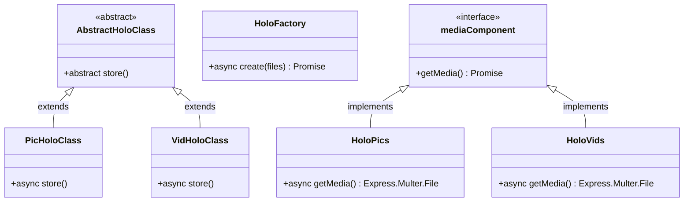
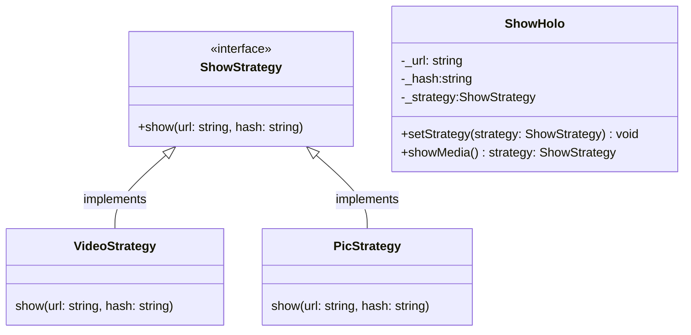

---
holoのバックエンド側。

mediaComponent。動画と写真を同様に扱えるようにするため、Composite Pattern で書いている。確かにあとから書いていて楽だった。

HoloFactory。写真と動画の分岐を隠蔽するくらいしか使えていないが、Simple Factory patternはよく使うので、一応

ShowHolo。Strategy pattern で書いてみたものの、media形式をそろえていることや機能が少ないことから活躍しているとは言えない。課金とかの要素が増えると、ここのstrategyが増えたりする予定。

---
memo

まずnpm install -g @nestjs/cliでnestのcliを入れる  
nest new MyAppで作成

githubでrepo作成  
localで  
git init  
git remote add origin  
git remote set-url origin <repoのsshのリンク>  
